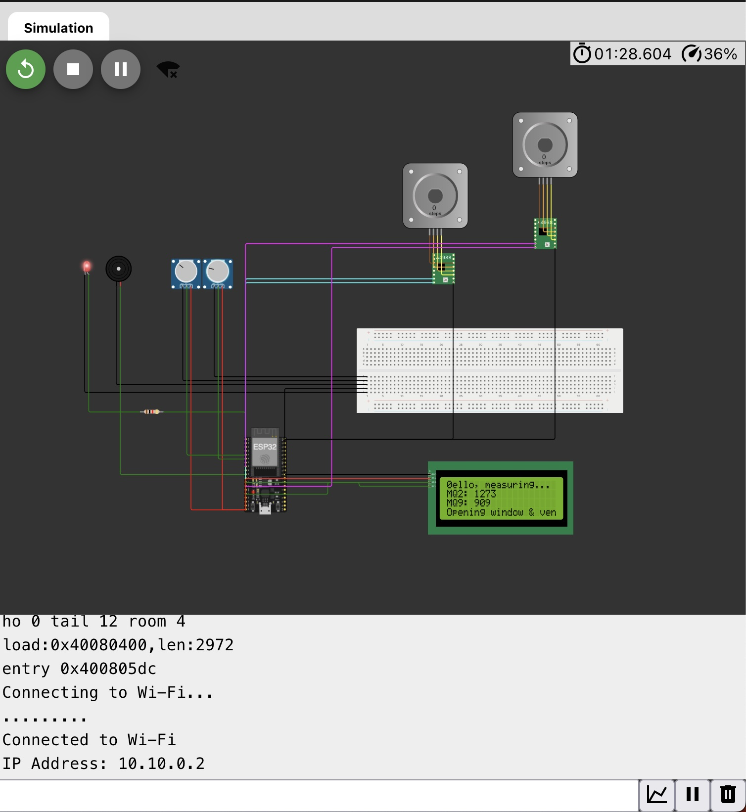
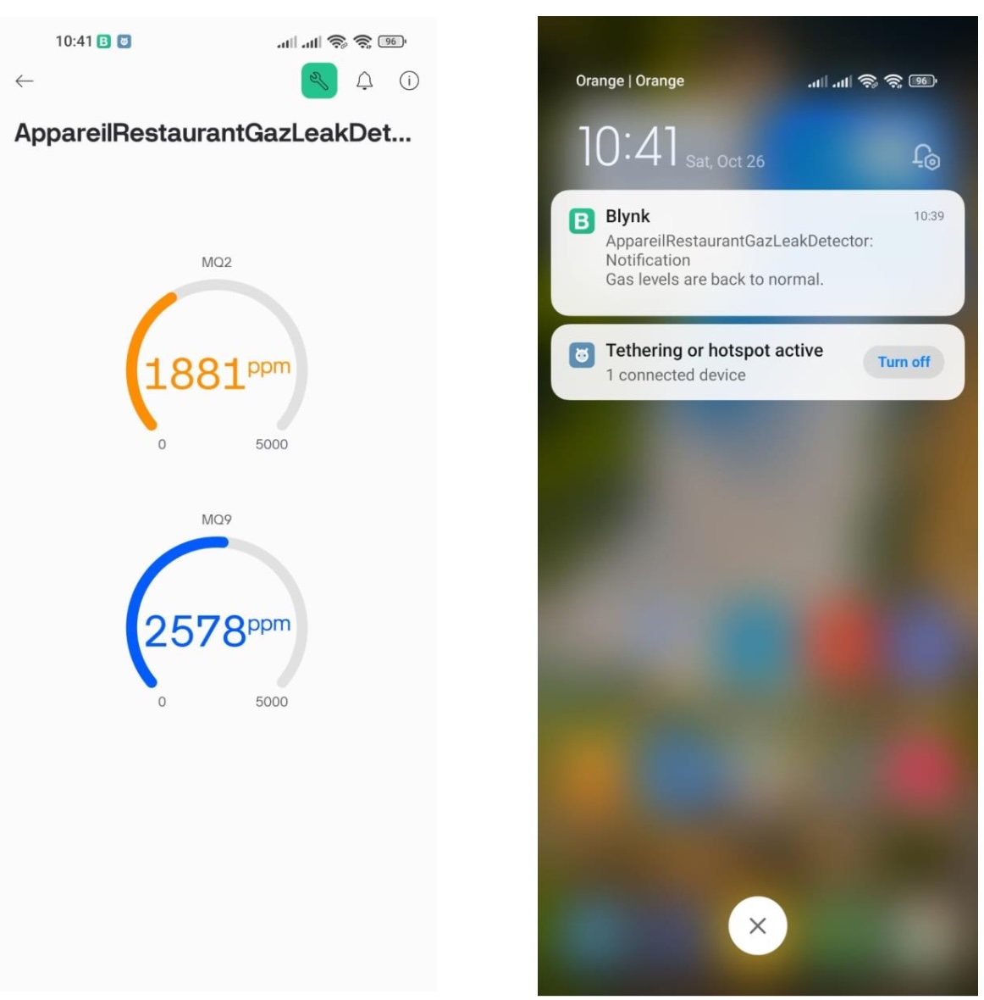

# Gas Leak Detection System with ESP32 and Blynk 🔍

## Overview

Gas leaks and fires pose significant risks to both safety and lives. <br />
This project presents an IoT based solution for detecting and alerting users to potential gas leaks and fire hazards. Using gas sensors (*MQ2* and *MQ9*) and an *ESP32 microcontroller*, the system continuously monitors toxic gas levels and triggers visual (using a *LED*) and audio (using a *Buzzer*) alerts when dangerous levels are detected.<br />
In addition to alerting, this system also takes preventive action by controlling windows and ventilation through *bipolar stepper motors* and their *drivers*.<br />
Real-time monitoring and notifications are sent to the user through the *Blynk* mobile application.<br />
The system is also equiped with *LCD screen* to informe the users of its current situation. <br />

## ✨ Key Features

- 🔍 **Real-time Gas Monitoring**
  - Continuous measurement using MQ2 and MQ9 gas sensors
  - Detection of multiple gases including methane, CO2, CO...

- ⚡ **Instant Alert System**
  - LED visual indicators
  - Audible buzzer warnings
  - Push notifications via Blynk app

- 🪟 **Automated Safety Response**
  - Smart window oppening Aand automatic ventilation activation via stepper motors

- 📱 **Mobile Integration**
  - Real-time monitoring through Blynk
  - Instant emergency notifications

## 🛠 Hardware Requirements

- ESP32 
- MQ2 Gas Sensor
- MQ9 Gas Sensor
- Bipolar Stepper Motors
- Stepper Motor Drivers
- LED 
- Buzzer
- Connecting Wires
- LCD (20x4) screen

## 📱 Software Requirements
- VSCode
- Wokwi (for simulation)
- PlatformIO (for libraries management)
- Blynk IoT App
- Required Libraries:
	- marcoschwartz/LiquidCrystal_I2C@^1.1.4
	- waspinator/AccelStepper@^1.64
	- khoih-prog/Blynk_WiFiManager@^1.0.16

## 📦 Installation

1. **Clone the Repository**
   ```bash
   git clone https://github.com/YoussefChahib/GasLeakDetector_ESP32_Blynk
   cd GasLeakDetector_ESP32_Blynk
   build and run the project using Wokwi for VSCode or on Wokwi online simulator

2. Update WiFi credentials and Blynk authentication token
   ```cpp
   #define WIFI_SSID "Your_SSID"
   #define WIFI_PASS "Your_Password"
   #define BLYNK_AUTH "Your_Blynk_Token"


<div align="center">
  
  <p><em>Simulation screenshot</em></p>
</div>

<div align="center">
  
  <p><em>Blynk Mobile Interface, and notification</em></p>
</div>
